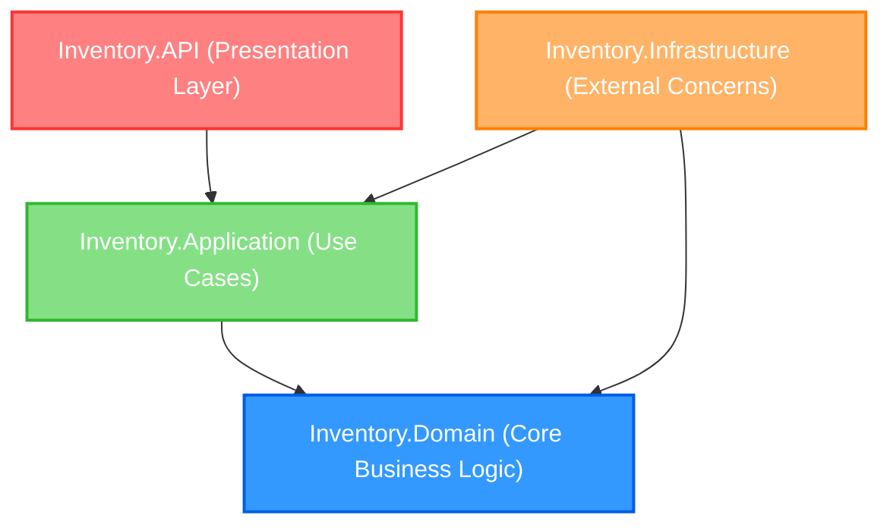
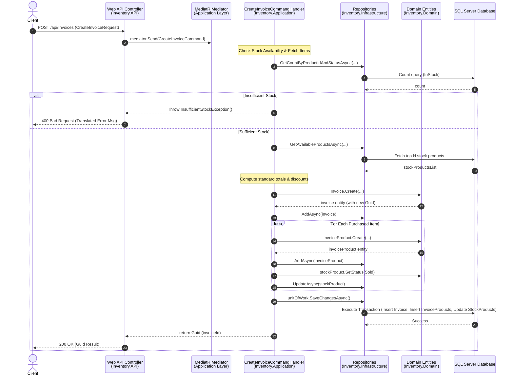
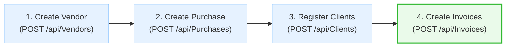

# Inventory Management System - Architecture & User Flow Guide

Welcome to the comprehensive architecture and workflow documentation for the **Inventory Management System**. This project is built using **Clean Architecture** principles in .NET 10, utilizing a decoupled, maintainable, and highly testable design.

---

## 🏛️ Project Architecture Overview

This project strictly follows the **Clean / Onion Architecture** style. The codebase is divided into four distinct layers, ensuring separation of concerns and database/framework independence.



### 📁 Project Component Responsibilities

| Layer | Component/Folder | Description & Responsibility |
| :--- | :--- | :--- |
| **Domain** | `Inventory.Domain` | **The Core Layer.** Contains pure business logic. It has zero external dependencies on other projects, ORMs, or frameworks. Contains: <br>• **Entities**: `Invoice`, `StockProduct`, `Product`, `Vendor`, `Client`, `Purchase`<br>• **Enums**: `StockProductStatus`, `InvoiceType`<br>• **Interfaces**: Core repository signatures (e.g. `IStockProductRepository`) <br>• **Exceptions**: Custom domain exceptions (e.g. `InsufficientStockException`) |
| **Application** | `Inventory.Application` | **Use Case Layer.** Defines application logic and coordinates data flow. Has no dependencies on infrastructure details. Contains: <br>• **Commands / Queries**: MediatR request objects <br>• **Handlers**: Implementations of business transactions <br>• **Interfaces**: App-level contracts like `IUnitOfWork` |
| **Infrastructure** | `Inventory.Infrastructure` | **Detail/Adapter Layer.** Handles database configurations, ORM mappings, concrete repositories, and external system integrations. Contains: <br>• **Persistence**: `InventoryDbDbContext`, `UnitOfWork`<br>• **Repositories**: Concrete EF Core implementations (e.g. `StockProductRepository`) <br>• **Configurations**: Entity Fluent API rules for database generation |
| **Web API** | `Inventory.API` | **Presentation Layer.** The application entry point. Handles HTTP requests, CORS, JSON serialization, and global middleware. Contains: <br>• **Controllers**: Exposes HTTP endpoints mapping requests to MediatR requests <br>• **Filters**: `DomainExceptionFilter` for parsing and translating domain errors to localized JSON responses <br>• **Translations**: Localization files (`en.json`, `ar.json`) |

---

## 🔄 How Layers Communicate

Communication between layers flows **inwards** toward the Domain Core. 

To maintain decoupling, the **Web API** does not execute repository or database actions directly. Instead, it sends command or query requests using **MediatR**'s in-process publisher. 

### 📞 Request Pipeline Sequence Diagram (e.g., Create Invoice Flow)

This sequence diagram illustrates how a client request flows through the architectural layers to execute business operations safely under a single unit of work transaction:



---

## 📈 Standard User Flow

The typical system lifecycle flows from vendor onboarding through stock procurement to customer billing:



### 1️⃣ Step 1: Create Vendor
- **Endpoint**: `POST /api/Vendors`
- **Request Body**:
  ```json
  {
    "name": "Global Tech Distributors"
  }
  ```
- **Result**: Returns a unique `VendorId` Guid. The Vendor acts as the provider of the inventory.

### 2️⃣ Step 2: Create Purchase
- **Endpoint**: `POST /api/Purchases`
- **Request Body**:
  ```json
  {
    "vendorId": "9b1deb4d-3b7d-4bad-9bdd-2b0d7b3dcb6d"
  }
  ```
- **Result**: Generates a unique `PurchaseId` Guid. This records a supply order session from a registered Vendor. (Stock products are registered to this transaction).

### 3️⃣ Step 3: Register Clients
- **Endpoint**: `POST /api/Clients`
- **Request Body**:
  ```json
  {
    "name": "Jane Doe",
    "phoneNumber": "+1234567890"
  }
  ```
- **Result**: Generates a unique `ClientId` Guid. A registered Client is required before issuing invoices.

### 4️⃣ Step 4: Create Invoices
- **Endpoint**: `POST /api/Invoices`
- **Request Body**:
  ```json
  {
    "clientId": "3fa85f64-5717-4562-b3fc-2c963f66afa6",
    "paidAmount": 1200.00,
    "invoiceType": "Sales",
    "products": [
      {
        "id": "c1f728c3-4d2b-4568-96ef-ecf10d7a6e1a", 
        "soldByPrice": 450.00,
        "qty": 2
      }
    ]
  }
  ```
- **Result**:
  1. Compares requested product quantities against currently active in-stock records (`StockProductStatus.InStock`).
  2. Resolves actual standard pricing from `StockProduct` to calculate `TotalAmount` and `TotalDiscount` dynamically on the server.
  3. Registers one mapping entity `InvoiceProduct` for each physical stock item sold.
  4. Marks the associated `StockProduct` records as `Sold` and records the current timestamp.
  5. Returns the generated `InvoiceId` Guid.

---

## 🛠️ EF Core Database Migrations Guide

> [!TIP]
> **No changes are needed** to these migration commands after encapsulating dependency registrations inside the Infrastructure project. The EF Core CLI tool will continue to resolve the DbContext correctly through the startup project's `Program.cs` execution.

Since the application uses a **Clean Architecture** setup where the DB context lives in `Inventory.Infrastructure` and the configurations compile via the entry point `Inventory.API`, you must specify explicit `--project` and `--startup-project` flags when running EF CLI commands from the workspace root.

### 📋 Prerequisites
Ensure you have the EF Core CLI global tool installed. If not, run:
```bash
dotnet tool install --global dotnet-ef
```

### 1. Create a New Migration
To generate a new database migration after modifying entities or configurations:
```bash
dotnet ef migrations add InitialCreate --project Inventory.Infrastructure --startup-project Inventory.API --output-dir Persistence/Migrations
```
- `--project Inventory.Infrastructure`: Specifies where the DB context and migrations will live.
- `--startup-project Inventory.API`: Tells EF Core where to read database connection strings (`ConnectionStrings:DefaultConnection`) from `appsettings.json`.
- `--output-dir Persistence/Migrations`: Places migrations cleanly inside the Infrastructure project directories.

### 2. Update the Database
To apply all pending migrations and update your local database schema:
```bash
dotnet ef database update --project Inventory.Infrastructure --startup-project Inventory.API
```

### 3. Remove the Last Migration (Optional)
If you made a mistake and want to roll back/delete the last created migration (before applying to DB):
```bash
dotnet ef migrations remove --project Inventory.Infrastructure --startup-project Inventory.API
```
